# Neural Network Methods for Natural Language Processing

tags: NLP, ML, DL, Book, NN

These notes are biased with my existing understanding of this topic so might miss things out. Please feel free to suggest changes, fork to make your own edits, and suggest constructive tips for taking better notes.

<!-- TOC -->

- [Neural Network Methods for Natural Language Processing](#neural-network-methods-for-natural-language-processing)
    - [Introduction](#introduction)
    - [Basic Linear models](#basic-linear-models)
    - [Linear to multi layer perceptron](#linear-to-multi-layer-perceptron)
    - [Feed forward NN](#feed-forward-nn)
    - [NN Training](#nn-training)
    - [Features for Textual Data](#features-for-textual-data)
    - [Case studies of NLP fetures](#case-studies-of-nlp-fetures)
    - [From Textual Features to Inputs](#from-textual-features-to-inputs)
    - [Language Modeling](#language-modeling)
    - [Traditional Language Modelling - MLE](#traditional-language-modelling---mle)
    - [Pre-Trained Word Embeddings](#pre-trained-word-embeddings)
    - [Using Word Embeddings](#using-word-embeddings)
    - [Case Study- Sentence Meaning Inference](#case-study--sentence-meaning-inference)
    - [CNN - ngram detector](#cnn---ngram-detector)
    - [RNN - Modelling sequences and stacks](#rnn---modelling-sequences-and-stacks)
    - [Concrete RNN Architecture](#concrete-rnn-architecture)
    - [Modeling with RNN](#modeling-with-rnn)
    - [Conditioned Generation](#conditioned-generation)
    - [Modeling Trees with RNN](#modeling-trees-with-rnn)
    - [Terms](#terms)
    - [Doubts](#doubts)
    - [Things To Read Up](#things-to-read-up)

<!-- /TOC -->

## Introduction
* Challenges in language
    1. *Discrete* : "pizza", "burger" no inherent relationship, it's all a concept in reader's head, can't figure it out directly
    2. *Compositional* : letters -> words -> sentences, sets of rules, and meanings are more than the words/sentences
    3. *Data sparseness* : infinite possibilities, new things keep coming, a dataset can never cover everything

* NN and DL
    * NN -learning parameterised differentiable mathematical functions
    * DL - multiple transformations on data, learns to predict AND correctly represent (encode) data

* DL and NLP
    * words become math objects
    * Architectures
	    * Feed forward NN
        * Convolutional NN
	    * RNN 

## Basic Linear models
* want to map input to output
* cant try all possible functions
* limit to a space/family of functions called *hypothesis class*
    * Problem - "inductive bias* - we are making assumptions about the form of the actual functions
    * benefit - easier to find solution
* For equation $f(\bm{x}) = \bm{x . W + b}$, parameter $\Theta = \bm{W,b }$
* Neaural networks are capable of representing any <b id="borel">Borel-measurable function</b>
* Splitting data
    * Leave One Out : Useful when small dataset (around 100). Train $f_i()$  leaving out a random $x_i$ every time. Train another $f()$ on all data. % of correct $f_i()$ gives an estimate of accuracy of$f()$
    * Held-Out : 80-20 split of data. Use the random 20 for testing
    * Train-Validation-Test : 3 way split. Use validation set to test, tweak, adjust and select model. Leave test set untouched. Prevents again bias of selecting model that was specially adjusted for validation set.

* Models
    * Features extraction : function that maps a real world object (an apartment) to a vector of measurable quantities (price)
    * feature engineering : designing the feature function
    * think of linear models in terms of assigning weights to features - easy to imagine
    * X,Y,W are all representations of the input. Main power of deep learning is the ability to learn good representations
    * One Hot vector : can be called bag-of-a-single-word
    * Bag of words : normalised collection of one-hot over the data. A frequency map of the list of words in your space
    * Continuous bag of words (<b id="cbow1">CBOW</b>) : low dimensional continuous vector
        * $y = xW =$ (sum 
    (one-hot of every word in unput))$\cdot W =$ sum ((every word's one-hot )$\cdot W$)$=$sum(rows of $W$ corresponding to each word)
        * $W$ is a dense word representation/embedding matrix
* Loss functions
     * Our objective is given below. First term is loss, second is regularization

$$\hat{\Theta} = argmin_{\Theta} \left( \frac{1}{n}\sum_{i=1}^{n}L(f(\bm{x}_{i},\Theta),\bm{y_i}) + \lambda R(\Theta) \right)$$
* 
    * Hinge loss(binary) $(\tilde{y},y)=max(0,1-y\cdot \tilde{y})$ where y $\in \{+1,-1\}$ and prediction is the sign of $\tilde{y}$. Thus, it attempts to acieve a correct classification with a margin of atleast 1 (like SVM) (can use another margin $m$ as well) as it also penalises predictions $\tilde{y}$ < 1
    * Hinge (multi-class) $(\hat{y},y)=max(0,1-(\hat{y}_{[t]} - \hat{y_{[k]}}))$ Where t is the correct class of y, and k is the highest scoring category $\ne i$ (y is a vector of scores over all categories). Hingle loss attempts to score the correct class above all other classes with a margin of at least 1 (can use another margin $m$ as well)
    * Log loss $(\hat{y},y)=\log(1+exp(-(\hat{y}_{[t]} - \hat{y_{[k]}})))$
    * Binary cross entropy $(\hat{y},y)=-y\log \hat{y} - (1-y)\log (1-\hat{y})$. Assumes output used sigmoid
    * categorical cross entropy loss $(\hat{y},y)=\sum_{i}-y_i\log \hat{y_{i}}$. Also called negative log likelihood. Assumes softmax is used. Tries to assign more mass to the correct class.
    * [Ranking loss](https://gombru.github.io/2019/04/03/ranking_loss/) : objective is to predict distance between inputs. Ex. matching faces vs mismatching faces. Used with pairs or triples of data points. We want to maximise distance between mismatches, and minimise otherwise.

* Regularization : If we have some incorrect/outliers, it is OK to miss classify a few but fit the majority of data well. Weights can be increased on some features to accomodate outliers, when the shouldn't be.
    * Avoids overfitting
    * makes sure weights don't take extreme value
    * controls the complexity of the function
    * Types : $L_2, L_1$, Elastic net (combo of $L_2, L_1$) and dropout (for NN)

* Stochastic Gradient Descent
    * can use GPUs for minibatch, so faster

## Linear to multi layer perceptron
* XOR - can't be done using linear model
* <b id="kernel-method">Kernel Method</b>
    * Transform non linear inout (XOR) to another space where it can be linearly separated, $\hat{y}=\phi(x)W+b$
    * might have to map to a higher dimension to be linearly separable
    * higher dimensitonal space mapping - more chances of getting a linear separator - but computationally expensive
* **Trainable Mapping**
    * mapping is also learned by using a non linear activation of the input
    * this is what a mulit-layer perceptron is!
    * solve XOR with this now. [solution](https://www.quora.com/How-can-we-design-a-neural-network-that-acts-as-an-XOR-gate)

$$\hat{y}=\phi(x)W+b$$
$$\phi(x)=xW'+b'$$

## Feed forward NN
* Perceptron $\hat{y}=xW+b$
* Theoretically, MLP1 (one hidden layer) can represent all continuous functions on a closed and bounded subset of $\mathbb{R}^n$, but we don't know the size of the hidden layer, or when will our algo reach that solution, how to reach that solution, how easy it is to find given the training data
* Non-linearities : sigmoid (outdated), tanh, hard tanh, Rectifier(ReLU)
* dropout - randomly drop some of the values of hidden layers to prevent the model from relying on some weights too much. Can be achieved by masking the output of hidden layer. Mask is sampled from a bernoulli distribution.
* Similiarity and distance between vectors
    * dot product, cosine
    * trainable
        * sim (bilinear)$(u,v) = uMv$
        * dist $(u,v) = (u-v) M (u-v)$
    * Can also use multi layer perceptron on concatenation of the two vectors
* embedding layer/lookup layer : map x to an embedding. $xE$ when x is one hot vector.

## NN Training
* Backprop Algo: reverse-mode automatic differentiation algo
* Initialization : Algo might give different results each time depending on the initialization and the local minima/saddle point it reaches. Use *xavier initialization* or *He initialization* to control the distribution and magnitude. They are known to work well. Are specific the the type of activation funtion used.
* **Model Ensembles** : use multiple models, then average them out or pick the best, or use some voitng
* Exploding, vanishing gradient
* saturated or dead nuerons : tanh and sigmoid get saturated when input is very large and give small gradients. ReLU gets stuck/dead at 0
* learning rate scheduling : reduce learning rate as the error stops impoving, basically take smaller steps as you get closer to the solution

## Features for Textual Data
* typology of MLP classification problems
    * word : eg. dog. what does it mea, what language, something about the word
    * Texts : Given a text, say about it, the sentiment, spam etc. Called Document Classification
    * Paired Texts : how similar, valid translation, follow logically
    * Word in context : eg. what does *book* in *I want to book a flight* mean. finding named entities, annotations, etc
    * Relation between two words in context : is A the subject of verb B, how is it related etc.
* **Token** : basically a word. When we tokenize a document after considering white spaces and punctuations. New York is a word but two tokens. Don't is one token but two words. Depends on how you tokenize
* indicator (0,1:exists or does not), count - frequency
* features for words : length, capital, etc
    * **lemma** (lemmatizing)- dictionary entry of a word, root. booking,booked,books - book(lemma). Context is important. Well defined rules.
    * **stemming** - pictures, picture - pictur. Depends on aggressiveness. Simpler and easier to implement.
    * Lexical resource - ex - WordNet. external resource that contains info about words
    * distributional information (discussed later)
* features for text
    * bag of words, can also use distribution of length of sentence over number of words, and other such numerical properties
    * Weighing : give weights to bag of words. **TF-IDF** : term frequency $\times\log$ inverse of frequency of the distinct documents this word appears in. This highlights less occuring words.
    * n-grams (discussed later)
* features of word in context
    * Window : immediate context of the word, k surrounding words. as feature, use the word and it's relative position
    * position of the word in the context
    * for relations between words in context, we can look at their relative distance and what appears between them
* **linguistic properties as features**
    * Use linguisitic rules/properties - syntax, morphology, discourse relations, syntactic trees etc
    * linguistic annotation
        * level 1: assign part of speech. eg. the(DET) boy(Noun) with(Prep) the(Det) black(Adj) shirt(Noun) opened(verb) the(det) door(noun) with(prep) a(det) key(noun)
        * level 2: mark syntactic chunk boundaries. ex. [noun phrase - the boy] [prep phrase - with] [noun phrase - the black shirt]....
        * constituency tree/phrase-structure tree: nested labeled bracketing over the sentence indicating the hierarchy of syntactic units. *the boy with the black shirt* is a noun phrase which itself is made of smaller units
         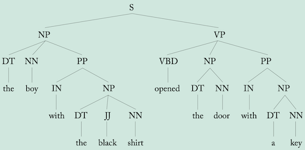
        * dependency tree: each word in the sentence is a modifier of another word which is called head. Each word in the sentence is headed by another sentence word, except for the main word, usually a verb, which is the root of the sentence and is headed by a special “root” node. This makes explicity the modification relations and connections between words
         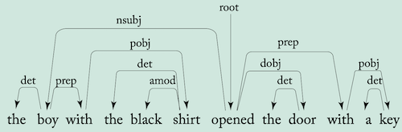
        * semantic role labelling 
        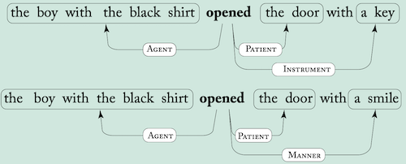
        * Discourse relation - between sentences. eg. Elaboration, contradiction, cause effect etc.
        * anaphora - coreference resolution. eg. *The boy opened the door. It wasn't locked and he smiled.* what do *it* and *he* refer to.
        * these concepts can be implemented as a part of the pipeline, or in a multi-task setup and improve the performance
    * Combination features
        * knowing features that occur in combination is also important. Above things will tell us document has the word *X appears at -1 position* and *Y appears at +3 position* which is not the same as knowing *X appears at -1 and Y appears at +3*. Ex. Paris, Hilton, and Paris Hilton are very different things. Fortunately, NN can take care of this to a good extent, linear models can't (and we have to hand craft them)
        * ngrams - consecutive word sequences of length n. Bag of bigrams has more info, but not all (eg. *of the*), but we let that network (and regularization) will take care of the weights
        * simple NN can't learn ngrams on their own so we need to give them. OR give encode positional info also. CNN, Bi-RNN can figure out these things.
    * **distributional hypothesis** of language : meaning of a word can be inferred from the contexts in which it is used (can use occurence pattern from contexts to know about words), *words are similar if they appear in similar context*, meaning of a word could be derived from its distribution in a corpus. Represent each entity as a vector("a pattern of activations")
        * clustering based methods
        * embedding based

## Case studies of NLP fetures
* Make use of all signal in data by
    * giving model direct access to them by use of feature-engineering
    * by designing the network architecture to expose the needed signals
    * by adding them as an additional loss signals when training the models
* Document classification-Language Identification : bag of letter bigrams (core feature)
* embedding detection : byte level bigram
* Document classification-Topic classification : bag of words, with bag of bigrams. Can replace words with their lemmas (if lack of data). Use word embeddings instead of one-hot. TF-IDF. Word indicators instead of frequency.
* Document classification-Authorship Attribution : find author's age, gender, name, or something else. Need to look at stylistic properties rather than the content. Features: Bag-of-function-words (of,on,and etc which connect content words) as well as pronouns, density of function words in a window, function word bigrams after removing content words, distance between function words.
* Word in context: part of speech (POS) tagging: usually modeled as a structured task—the tag of the first word may depend on the tag of the third one—but it can be approximated by classifying each
word in isolation based on a window of words. We have 
    * intrinsic cues (based on the word itself) : prefix, suffix, frequency, identity of the word etc 
    * extrinsic cues (based on its context) : prefix suffix if the words nearby, POS of already classified words, etc
    * prefix suffix are useful to include in model because we might encounter a OOV(out of vocab) word
* Word in context-Named entity recognition(NER): find named
entities such as *Milan, John Smith*. Also categorize them
into a pre-defined set of categories such as *Location, person* etc. Very context dependent. (Paris can be location/person). Often modeled as a sequence tagging task, like POS-tagging. Also structued like POS but approximated with a window. Almost similar features as POS. Distributional features of words are helpful for context. Can use **BIO encoded tags** for tagging.
* Preposition sense disambiguation: Assign the correct sense in context. Limit to a finite set of senses. Ex. I paid *for* her (beneficiary), we ate *for* two hours (time) and so on.
    * preposition itself, context
    * A window is not most helpful. "He liked the round object *from* the very first time he saw it.", "He saved the round object *from* him the very first time they saw it". Similar things. Better to use a triple, <liked,from,time>=<governor, prep, prep object>. More informative.
    * Above needs preprocessing of POS tagging, or syntanctic trees. Then get more information about the governor, object words like their lemma, WordNet, prefix, suffix etc.
* dependency parsing task: given a sentence, return a syntactic dependency tree over it.
    * Arc-factored parsing: score each word pair relationship independently and then try to create a tree with maximal overall score
    * features for scoring: words, POS tags, words/tags in a window of given head and modifier pair, distance(strong feature), direction(head before or after modifier, ex. the book), info about the words/pos-tags between the pair words (can use bag-of-words)
* event extraction task: involves identification of events from a predefined set of event types. Ex, identification of
“purchase” events or “terror-attack” events. Event type triggered by various triggering words (commonly verbs),
and has several slots (arguments) that needs to be filled (i.e., Who purchased? What was purchased? At what amount?).

## From Textual Features to Inputs

* encoding categorical features
    * one hot encoding
        * each feature has it's own dimension, features are independent
        * "word is dog" is dissimilar to "word is cat" so similiarities are not present - better to use when we have distinct features with no correlation
    * dense encoding (feature representation) : word as a vector in *d* dimensional space. Embedding is a parameter
        * d dimension, computational benefit
        * similar features have similar vectors : *generalizes* very well. If training has *dog* more, few *cat* but model will be able to handle (given we have pre trained embeddings)
* so NLP problem becomes: extract relevant core features, convert to feature vector, combine (concat, sum or both) into **x** and feed into the network
* combining features
    * window : concat (when order in important), sum (or weighted sum) of word vectors. Can use different vectors for the same word depending on it's relative position(harder to train), maybe encode position in some other way
    * variable number of features: eg. words in a sentence. feed forward models take fixed size input. So use **CBOW or weighted CBOW (WCBOW)** - just sum/average the embedding vectors of the features. Weight can be the word's TF-IDF score for example.
* **NOTE:** Sparse and dense embeddings: using sparse, one-hot vectors as input when training a neural network amounts to dedicating the first layer of the network to learning a dense embedding vector
for each feature based on the training data (except for non linear activation and bias) : so differences between these two is not much. Mathematically, [this](#cbow1), $v(\bm{f_i})= \bm{f_i} \cdot \bm{E}$ and $CBOW=\sum_{i}^{k}\bm{v(f_i) }=\sum_{i}^{k}\bm{f_i \cdot E} =(\sum_{i}^{k}\bm{f_i})\cdot \bm{E}$ which is what first layer will be.
* Distance and position features: best to use a dense embedding instead of one-hot. Also useful to bin the distances like (1,2,3,4-8,9+) before using embedding
* **padding**: sometimes info like no word on left, no word on right, no modifier, etc are important. When feature to be extracted does not exist, best to include an special padding symbol in the embedding to give such signals. Also add different padding vectors for situation (ex. no-left, no-right)
* Unknown words
    * use a special symbol to denote OOV words
    * <b id="word-signature">Word Signatures</b>: like a clustering of unknown words. Ex. back off all words like ___ing to one symbol, all numbers to another and so on. Helps a lot with the model!
    * **word dropout**: What if no unknown words in training data? then model will not learn about the unknown symbols. So during training, randomly replace words with unknown symbol. Can use $\frac{\alpha}{\#(w)+\alpha}$ to consider freq of words.
* can use word dropout (with bernaulli) to regularise model and avoid depending too much on some words (don't replace dropped words with unknown, that won't make sense)
* combination of features: taken care of by nonlinear models
* vector sharing: If words behave differently when they appear in different positions (e.g., word X behaves like word Y when in the
previous position, but X behaves like Z when in the next position) then it may be a good idea to use two different vocabularies and assign a different set of vectors for each feature type.
* dimension of features, choice of embedding vocab, **note**: the weight(columns) in output layer is also like an embedding matrix for the output
* Ex. POS Tagging : make feature fector of boolean indicators and embedding vector for word, prefix, suffix. Concat these for words in a window and embeddings of known POS to get feature vector ($\phi(s,i)$) = **x**. Can also use a different embedding vocabulary for word's relative position (dog at -1, dog at -2) but computation increases significantly.
* Ex. ARC-factored parsing: encode things and concat, bag-of-words for words between head and modifier and concat with encodings for head and modifier. **Tip**: Can also use a non linear transformation $\bm{v'}=g(\bm{vW+b})$ on embedding vector $\bm{v}$

## Language Modeling
Language modeling
* task of assigning a probability to sentences in a language, $P(w_{1:n})$. Ex. what is the probability of seeing the sentence *the lazy dog barked loudly*?
* also assigns a probability for the likelihood of a given word (or a sequence of words) to follow a sequence of words. Ex. P(*dog* appears after *the lazy*)
* Note that, $P(w_{1:n})=P(w_1)P(w_2|w_1)...P(w_n|w_{1:n-1})$,i.e., a sequence of word prediction task conditioned on preceding words
* $P(w_n|w_{1:n-1})$ would require modeling the entire sentence. So we can use a kth order **markov-assumption** $P(w_{i+1}|w_{1:i})\approx P(w_{i+1}|w_{i-k:i})$. k preceding words are good enough for prediction. Obviously this is technically incorrect and modern networks don't need this assumption.

<b id="perplexity">Perplexity</b>
* low perplexity = better fit
* intrinsic method of evaluation, works only for comparison when same corpus is used, measures quality of langauge model, not task specific, not good for evaluating performance on task, can measure ability to pick-up regularities in sequences
* given a text corpus with n words (can be millions), 

$$perplexity = 2^{-\frac{1}{n}\sum_i^n LM(w_i|w_{1:i-1})}$$

## Traditional Language Modelling - MLE
Use Maximum likelihood estimate. Let $\#w_{i-k:i}$ be the count of the sequence $w_{i-k:i}$ in a corpus,

$$p(w_{i+1}|w_{i-k:i})=\frac{\#w_{i-k:i+1}}{\#w_{i-k:i}}$$

* 0 occurence of one such sequence in corpus = 0 probability of whole corpus (chain rule) = $\inf$ perplexity
* Zero occurence - highly possible - all combinations don't make sense so might not occur - large number of possible combinations to be covered in corpus - ex. 3 word seq, vocab size $10^4$, possible sequences $10^{12}$!

<b id="smoothening-mle">Smoothening</b>

Lots of techniques.

* add-$\alpha$ smoothening: simplest. Assumes each word occurs atleast $\alpha$ times.

$$p(w_{i+1}|w_{i-k:i})=\frac{\#w_{i-k:i+1}+\alpha}{\#w_{i-k:i}+\alpha|V|}, 0<\alpha\leq 1$$

* Back-off: if k-gram not found, try to estimate based on (k-1)-gram. Can be as below, ($\lambda _{i-k:i}$ should depend on context, rare words should be treated different than frequent ones)

$$p(w_{i+1}|w_{i-k:i})=\lambda _{i-k:i}\frac{\#w_{i-k:i+1}}{\#w_{i-k:i}}+(1-\lambda _{i-k:i})p(w_{i+1}|w_{i-(k-1):i})$$

* more detailed notes [here](http://www.cs.columbia.edu/~mcollins/lm-spring2013.pdf)
* shortcomings: can't scale well to larger ngrams, can't capture longer dependencies, have to handcraft back-off, larger ngrams are sparse too, models don't generalise well (*black car* not same as *red car* in the probability estimate), #(possible sequences) increases polynomial with increase in n-gram thus a polynomial increase in calculating prob. dist.

Neural Language Modelling
* Fixes above problems.
* concat embeddings of the context k-1 words in kgrams of corpus, target is kth word, use cross entropy loss
* linear increase in parameters with increase in ngram size, or increase in vocab size
* BUT, increase in output vocab increases cost of matrix calc in last layer as well as the softmax
    * **Hierarchial softmax**: create a tree of output probabilities. Assuming we want to know prob for a single word, complexity gets $\log n$
    * **Self-Normalizing approach**: Noise Contrastive Estimation(NCE)-  replace the cross-entropy objective
with a collection of binary classification problems, requiring the evaluation of the assigned scores for k random words rather than the entire vocabulary. *Normalization term approach* add a term to training objective so that all exponential scores sum to 1 so don't need to explicitly add. *Sampling Approaches* approximate the training-time softmax over a smaller subset of the vocabulary.
* better perplexity than traditional ones, scales well, shared params, can learn to use smaller ngrams, can use skip-grams (skip a few words in between), learn combination of words, generalises, can make our own creative contexts
* limitation: predicting over large output vocab is computationally expensive, models are also computationally expensive than traditional ones
* can use a **combination** of traditional and neural: Neural generalizes well, but sometimes that might not be desirable (*orange horse* (unreasonable) after learning *black horse* and *white horse*)
* generation: start with a start symbol, sample first word conditioned on start symbol from the distribution and so on until end of sentence symbol. For sampling- get top score, randomly select, beam search. Greedy approach not always best. 

## Pre-Trained Word Embeddings
* Initialization
    * if enough data, treat embedding as parameter and start randomly(use xavier inilialization or something apt)
    * use pretrained embeddings
* train on one task A and then use the embedding as pretrained for other task B (if B doesn't have enough data), or use multi-task learning
* Unsupervised : need to use when no auxiliary task, less amt of annotated data, want to bootstrap with better word vectors
    * create auxiliary task with large number of supervised training instances from raw text 
    * **note** we hope these tasks are close to our task, as similiarity between words should capture the aspects of similarity useful for our task
    * approaches: predict word from context or context from word
    * algos: Word2Vec, GloVe (discussed later)
    * choice of auxiliary task (target, context) is VERY important
* pretrained embeddings
    * preprocess, embedding vector norm is usally equal to frequency, normalize according to use case
    * keep embedding fixed
        * $\bm{E'=ET}$, trainable T, learned transformation will transform other vectors as well. <i id=doubt1>"The downside of this approach is the inability to change the representations of some words but not others (for example, if hot and cold received very similar vectors, it could be very hard for a linear transformation T to separate them)"</i>
        * $\bm{E'=ET+\Delta\text{ or } E'=E+\Delta}$, trainable T, $\Delta$(initialize with 0). Use strong regularization for $\Delta$ to keep embeddings close to original
    * treat it as parameter and fine tune it for task at hand
        * +ve: fine tunes to our task
        * -ve: tunes to wrods in corpus and might lose generalisation
* **Word-Context matrices**: $\bm{M}^f(i,j)=f(w_i,c_j)$, $f$ is association measure of strength between word $i$ and context word $j$ in the context vocab from a large corpus. (context can be defined as the previous word, last 5 words, etc)
* vector similarity measures
    * cosine
    * <b id="jacaard">Jacaard similiarity</b>: 
   
    $$sim(\bm{u,v})=\frac{\sum_i min(u_i,v_i)}{\sum_i max(u_i,v_i)}\\im(\bm{u,v)=\frac{u\cup v}{u\cap v}}, \text{when }\bm{u,v}\text{ are sets}$$
* **Word-Context Weighting and PMI**: 
    * $f$ can be defined as frequency or normalized frequency of $w_i$ occuring in context $c_j$ $\#(w_i,c_j)$, unfair advantage to *the cat* (more #) over *cute cat*, but latter is more informative
    * f should consider contexts that co-occur more with given word. <b id="pmi">Pointwise Mutual Information</b> (PMI), (|D|=size of corpus)

$$\text{PMI}(x,y)=\log\frac{P(x,y)}{P(x)P(y)}\\\text{can be estimated as}, \text{PMI}(w,c)=\log\frac{\#(w,c)\cdot|D|}{\#(w)\cdot\#(c)}$$
*   *   * If $P(w,c)=0$, then PMI=$-\inf$. So PMI$(w,c)$=max(PMI($w,c$),$0$)
        * PMI tends to assign high value to rare events.  Ex., if two events occur only once.
    * Issues
        * huge size of matrix
        * sparse matrix
        * representation depends heavily on the contexts in data set, might miss out some relationships if not in data set
    * Solution: SVD and extract d vectors. $\bm{WC^\top}=M'$ where W is $|V_W|\times d$ and C is $|V_C|\times d$. Can calculate vector similarities using the d dimensional vectors in W (as W=UD, M=UDV, can use UD to calculate dot product of rows)
* **distributional representation**: low dimentional representation of words, single dimension (column) does not neccessarily correspond to one context/meaning/concept. Single dimension can denote multiple meanings, multiple can denote single concept.
    * discussion till now is probabilistic and requires
        * get probability dist. over words
        * chain-rule requires conditioning on preceding context (k-gram)
    * Collobert and Weston
        * context is words surrounding the word, not preceding (*w1,w2,t,w3,w4* instead of *w1,w2,w3,w4,t*)
        * calculate score instead of probility
            * no need to normalize -> saves computation, scales to vocab of any size
            * **score** calculated with MLP, input is concatenated embedding of word and context words
            * loss function - ranking margin loss (margin=1)
            * uses correct and random example to train with the loss function
            * loss = $max(0,1-(s(w,c_{1:k})-s(w_{random},c_{1:k})))$
    * <b id="word2vec">word2Vec</b> ([refer](http://web.stanford.edu/class/cs224n/readings/cs224n-2019-notes01-wordvecs1.pdf) section 4)
        * 2 context representations: CBOW and skip-gram
        * 2 types of objective functions: Negative sampling(NS), hierarchial softmax [Use Stanford Notes](http://web.stanford.edu/class/cs224n/readings/cs224n-2019-notes01-wordvecs1.pdf) - Section 4
        * Negative Sampling Objective: sets $\bm{D}$, $\bm{\bar{D}}$ of good and bad(negative) examples of word-context pairs
            * use probability instead of scores, $P(D=1|w,c) =1$ if pair is good, $P(D=0|w,c) =1$ if pair is bad
            * probability is sigmoid of the score
            * maximise L = $\sum_{D} P(D=1|w,c) + \sum_{\bar{D}}P(D=0|w,c)$
            * negative sampling: for each good pair (w,c) pick k random words as negative samples. Can use frequency distribution for sampling
    * CBOW
        * predict word from context
        * context of size m = $x^{c-m},x_{c-m+1},..,x_{c-1},x^{c+1},..,x^{c+m}$ where c is the center word, x is one-hot encoding of context word
        * convert into n-d embedding using $E^{n\times |V|}$
        * take average, $\hat{v}$ - so CBOW
        * generate a score over all words, z = $U^{|V|\times n}\cdot \hat{v}$
        * Using softmax objective:
            * convert scores into probability using softmax. Each row of $U$ is actually output word vector encoding. (because  probability =1 for the correct word $w_c$, and that would require a zero multiplication wil all other rows of $U$ leaving only $u_c$)
            * use cross entropy loss. $-\sum_1^{|V|} y_i\log\hat{y_i}$, since $y_i=0$ for everything except the correct one, we get loss = $-\log\hat{y_i}=-\log\frac{exp(u_c\hat{v})}{\sum_1^{|V|} u_i\hat{v}}$. This is for one word.
        * negative sampling: refer standord notes
    * Skip-Gram
        * predict each context word from center word
        * encode x using $E$ and then use $U$ to get scores for all context words in vocab
        * take softmax to get probabilities $\hat{y}$
        * we want to maximize probability for context words, so $\hat{y}_{c-m},\hat{y}_{c-m+1},..,\hat{y}_{c+m}$. Treact each as one hot, so we get output shape $C\times V$ (c= #context words)
        * use an independence assumption and optimize for each context independently. So the loss is

        $$-\log P(w_{c-m},....,w{c+m}|w_c)\\=-\log \prod_{c-m,m\neq c}^{c+m} P(w_i|w_c)\\=-\log \prod_{c-m,m\neq c}^{c+m} P(u_i|v_c)\\=-\log \prod_{c-m,m\neq c}^{c+m} \frac{exp(u_i^Tv_c)}{\sum_1^{|V|} u_j^Tv_c}$$

*   *   * note that, $-\log P(u_i|v_c)=H(\hat{y}_i|y_i)$ (cross entropy loss)
    
* Noise Contrastive Estimation : similar to Skip Gram Negative Sampling but uses below probability function. Second term in denominator is observed unigram frequency of the word in text corpus.

$$P(D=1|w,c_i)=\frac{exp(-w\cdot c_i)}{exp(-w\cdot c_i) + \frac{\#(w)}{|D|}}$$

* GloVe [stanford notes]() : Aims to minimise below cost function:

$$w\cdot c_i + b_{[w]} + b_{[c]}=\log \#(w,c)$$

* Choice of context
    * common to choose surrounding words
    * short window: produces syntactic and functional similarities (running, jogging, walking)
    * longer window: produces topial similarities (cat, fur, meow)
    * add positional encoding to produce even better vectors
    * use weights, variable window size and many other ways- hyperparameter in itself
    * syntactic window: 
        * parse through a dependency parser
        * Choose words closer in the parse tree together with the relation that connects them
        * produces strong syntactic, functional similiarities. Words that can fit in the same role in a sentence (eg, color, dog name, types of dances etc)
    
* character/sub word based representation
    * useful for tasks that are syntactic in nature
    * small matrices and still cover all words, alleviates unknown word problem
    * too hard constraint though. Can use a combination of word vector with vector of sub-words that make the word. can share forms, back off to subword in case of unknow words etc. A middle ground.
    * break words into some "meaningful units". <b id="bpe">Byte Pair Encoding</b>. Decide on vocab size $n$ and derive $n$ units that can make all the words in corpus.

* Multi-words: How to handle words like "New York" which should be a single vector
    * make a list of such words
    * merge words pair whose PMI>threshold, then merge pair+words and so on to update the vocab (Done in word2vec)
* Word Inflections: In some languages, word takes form depending on it's gender/number/etc. Form changes a lot so how to handle?
    * deterministically preprocess to fit the desired meaning
    * lemmatize the words and use lemmas instead of words

* **Limitations of Distributional Methods**
    * Definition of Similarity: Depends a lot on the text and how we train. Can't control everything. *cat* might be similar to *dog* but is also actually similar to *tiger*. So we can't be sure if we capture everything.
    * Black Sheep: a well-documented bias in people’s use of language, stemming from efficiency constraints on communication - people are less likely to mention known information than they are to mention a novel one. Eg. white sheep as *sheep* but black sheep specifically as *back sheep*, so missing out on info.
    * Antonyms: they appear in similar contexts, so get similar encoding. Eg. something is hot/cold
    * corpus biases: all sorts of biases (gender, racial etc) in text and author are also encoded
    * lack of context: takes up all sorts of context and sort of aggregates them. Embedding becomes context independent. For ex. for a word like *bank* having multiple meanings, we are using same embedding for all. Other such context problems.
    
## Using Word Embeddings
* word clustering: cluster embeddings to get feautures or use discrete symbols
* similar words: get $k$ most similar words. Can use cosine similarity. normalize embedding matrix $\bm{E}$ and calculate $\bm{Ew}$ to get the vector of similarity of $\bm{w=E_i}$ with each word.
* similarity to a group of words: eg. extend a list of given 4 countries, give a sense of word etc. Take cosine similarity with the average of the word vectors of the group. $\bm{Ew_{avg}}$
* find odd one out in a list of given words: calculate similarity of each word with the average vector
* similarity between short documents: $D1=(w_1^1,w_2^1,w_3^1,..)$ and $D2=(w_1^2,w_2^2,w_3^2,..)$, then     
    * document similarity=pairwise word similarity=$\sum_i\sum_jcos(w_i^1,w_j^2)=(\sum_iw_i^1)\cdot(\sum_jw_j^2)$ (last equality if vectors are normalized). This is just Bag-of-words. 
    * Given a collection of documents **D** where each row is a BOW representation of document $D_i$ then similarity of a new document with collection is $\bm{D\cdot(\sum_iw_i^{new})}$
* word analogies: (*man:woman->king:?*)
    * Word vector can help solve this by $w_{king}-w_{man}+w_{woman}\approx w_{queen}$
    * calculate below, $\underset{v\in V\setminus\{m,w,k\}}{\text{argmax}} \cos(v,k-m+w)=cos(v,k)-cos(v,m)+cos(v,w)$ (for normalized vectors). 
    * This is called <b id="3cosadd">3CosAdd</b>
    * issue:since summation, one can overrule others
    * so use $\frac{cos(v,k)\cdot cos(v,w)}{cos(v,m)+\epsilon}$
* **Retrofitting**: Want to make sure the embeddings capture the similarities important for our task. Can use a smaller space of word-pair relationships to improve the quality of embeddings. Ex. Use WordNet to create a graph of similar words connected by edges. Create a new $\bm{E'}$ whose rows are close to original $\bm{E}$ and also to the rows of similar words (neighbours) connected by edge in graph. Optimization function:

$$\underset{\bm{E'}}{\text{argmin}}\sum_i^n(\alpha_i\bm{||E'_{[w_i]}-E_{[w_i]}||+\beta_i\sum_{(w_i,w_j)\in Graph} ||E'_{[w_j]}-E'_{[w_i]}||})$$
usually, $alpha_i=1$ and $\beta_i$ is set to inverse of #(neighbors)/degree of node $i$.
* **Projection**: We have two embeddings trained separately. One is small  (maybe expensive and better for task) Other is large (maybe pre-trained). Have common words and we want to use second when word not in first. So we transform embeddings ($\bm{M}$) of second using embeddings of common words

$$\text{argmin} \sum_{w\in V(L)\cup V(S)}(||\bm{E^L_{[w]}\cdot M - E^S_{[w]}}||)$$

* **Note & Tip**: 
    * When using off-the-shelf embedding vectors, it is better to use the same tokenization and text normalization schemes that were used when deriving the corpus
    * Be mindful of the objective function used when using pre-trained embeddings
    * be mindful of the limitations of distributional methods
    * sometimes a small but carefully annotated data can give better embeddings

## Case Study- Sentence Meaning Inference
* SNLI - Stanford Natural Language Inference
    * focuses on image captions, easier than RTE
    * given sentences s1 and s2, figure out if s1 entails from s2(can be inferred), contradicts s2 or is netural(neither entails nor contradicts)
    * ex. Given: Doctors are doing surgery on a patient. *entails*- Doctors are doing surgery. *contradicts*- Doctors are drinking. *Neutral*- Doctors are doing surgery on a man.
* RTE - Recognizing textual entailment. Harder. Ex. *Before the trial, I was in Suzie's office in Boston => Suzie's office is in Boston.*
* Can't simply be solved by word similarity. Need to understand what words add more information (*patient* to *man*), what words preserve meaning (*man* to *patient*), what contradicts (*surgery* to *drinking*)
* Architecture:
    *  Use pre trained encodings
    * MLP layer to transform into better similarity measure and give word level alignment
    * for each word in sentence a, calculate **alignment vector** over sentence b and then take weighted sum. Similarly for b. Gives a weighted vector of b $\bar{w_i^b}$ for each $w_i^a$. This is **attention mechanism**
    * use $w_i^a$ and $\bar{w_i^b}$ with MLP to get task relevant info from pair. (also looks at the sentence the word came from. Ex direction on *patient* in a to *man* in b)
    * aggregate for all i in a, all j in b
    * pass through another MLP to decide
    * refer book for details. Chapter is short enough.

## CNN - ngram detector
* Why ngram?
    * CBOW omits order
    * difference between *not good* and *not bad* not taken
    * group of words more informative than single words
* Why not embed ngram?
    * too large space
    * not scalable
    * data sparsity ("quite good", and "very good" won't be the same)
* CNN
    * Identifies local patterns/predictors in large structure
    * produces a representation which has info about local predictors relevant to the task
    * no need to specify all ngrams
    * shares weights between similar ngrams - data sparsity problem solved
    * can model non-contiguous ngrams too
    * **Note**: functions as a relevant feauture (meaningful info) extractor, not sufficient on it's own for a task
* **Receptive Field**: the k-word sliding window
* **Filter**: non-linear function over the receptive field that transforms the window into a scalar. Can use multiple (say $l$) such filters to get a $l$ dimensional vector
* **pooling**: combine several scalars from windows into one. Tries to get the most important "feature"
* filters extract different information from each window (kgram) and pooling focuses on the most important one
* **Convolution**
    * 1D: because applied on sequence of words/text as opposed to 2d images
    * concat word vectors in a k size window $\bm{x_i=[w_i;w_{i+1};...;w_{i+k-1}]}$
    * apply filter $\bm{u} \in \mathbb{R}^{k\cdot d_{emb}}$ to get $\bm{p_i}=g(\bm{x_i\cdot u})$, g is non linear activation
    * can use $l$ such filters($\bm{u}$ becomes $\bm{U}$) to get $l$-dimensional $\bm{p_i}=g(\bm{x_i\cdot U + b})$, adding bias as well
    * sentence size = n, window size = k
        * we have m=n-k+1 window positions, hence, the length of the output. **Narrow Convolution**
        * can pad the sequence with zeros to get >= n in output (eg. pad with k-1). **Wide Convolution**
    * Alternate approach: Instead of concatenating vectors, consider a matrix of word emeddings in sentence $n\times d$, apply matrix convolution with $l$ of $k \times d$ filter/kernel, sliding over the sentence matrix
        * matrix convolution: take element wise product of two matrices and sum them
    * **Channels**: like RGB in images, we can use different point-of-views of data. Word encoding, POS tag, etc can each be a different channel. Apply filter on each channel and combine (sum/concat) to get on vector
    * **Pooling**
        * combine the windows into one, capturing the most important apects of the sequence. all of $\bm{p}_{1:m}\rightarrow \bm{c}$
        * After training, the weights(of other layers) are expected to be tuned in such a way that pooling gets important feature
        * max-pooling
        * average pooling (like bag-of-words of convolutions)
        * k-max pooling: take a number of (eg. k, need not the same as window size) highest values instead of just max. so $m\times l$ matrix of $p$ becomes $k\times l$ and then concat(row after row) into $lk$ sized $c$
        * dynamic pooling: instead of pooling the entire sequence, split $\bm{p \text{ into } p_1,p_2,..,p_r}$ and pool each separately giving $\bm{c_1,c_2,..,c_r}$ and then concat them
            * needed when different parts of document can have different importance contribution
            * eg. in document classification, the start and end of document should be pooled differently
    * variations
        * convolution of parse tree dependency paths etc
        * apply different sized filters parallely, pool each and then concat all
* <b id="feature-hashing">Feature Hashing or Hash Kernels</b>
    * convolutions are computationally expensive
        * efficent to use ngram embeddings and pool(avg/max) them in a window
        * but huge number of ngrams are possible
    * Create embedding matrix $\bm{E}$ with N rows. N is reasonable size of vocab
    * use a hashing function to assign each ngram encountered in training a row of $\bm{E}$. Use this as the embedding vector
    * Collisions
        * not all ngrams are relevant so training will take care of them
        * use $r$ hash functions. each ngram embedding is the sum of rows given by each hash function. This way, ngrams will not collide (since we are using a combo of multiple hash)
* Hierarchial Convolutions
    * Stack convolutions on top of each other
    * captures larger sequences, ngrams and gappy ngrams as well (eg. not __ good)(eg. skip adjectives/conjugations/etc *fancy __ appealing* from *fancy and appealing*)
    * 1 layer -> window has k word, 2 layers -> window will cover k+k-1 words,..., r layers -> window cover k + (r-1)(k-1) words
    * **Stride**: consecutive windows skip s number of words. eg. window start indexes: 1,2,3,4,.. -> 1,3,5,7,..(stride 2)
    * dilated convolutional architecture
        * stack conv layers with k-1 stride ->exponential increase in the effective window size
        * alternatively, keep stride=1 but use pooling after each layer to reduce the size of the sequence. Effectively exponential increase in effective window size
    * **parameter Tying**: use same $\bm{U}$ and $\bm{b}$ in each layer. Use narrow Convolution. Need not fix number of layers. Reduces any length sequence to a fix dim vector
    * **Skip connections**: input vector to layer i is vector from layer i-1 and a previous layer in network (concat/sum/average)

## RNN - Modelling sequences and stacks
* Pros
    * allow arbitrary sized sequential input and convert it to fixed dimensional vector
    * LSTM, GRU capture long term dependencies and capture statistical similarities
    * do not make the markov assumption
    * good perplexity scores

* RNN abstract
    * sequence of vectors $x_i,...,x_j$ is $x_{i:j}$
    * for any n

$$y_n = RNN(x_{1:n}),\text{  }x_i\in\mathbb{R}^{d_{in}},\text{  }y_n\in\mathbb{R}^{d_{out}}$$
* * Since,  this implies we know $y_i$ for all $i<n$, we can rewrite above as

$$y_{1:n} = RNN^*(x_{1:n})$$
*   * output vector used for further predictions or input to another model
    * inside RNN, state vector $s_i$, $s_0$ is random or zero. Keeps track of state of computation
    * share a common parameter $\Theta$ across all i

$$RNN^*(x_{1:i},s_0)=y_{1:i}=O(s_i)=R(x_{1:i},s_{i-1})$$
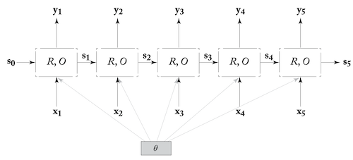
*   * so $s_n$ and $y_n$ encode the entire sequence
    * later elements have a strong impact on $s_i$ - need to design $R$ to avoid that

* RNN Training
    * Unroll the computation graph, add loss function, backprop : <b id="bptt">Backpropagation Through Time</b>

* RNN Usage
    * Acceptors : use final $y_n$ directly for prediction. Ex. sentiment classification
    * Encoder: use final $y_n$ as input to some model. Just encodes the sequence
    * Transducer: can be used for sequence tagging, language modelling. Special cases are RNN generator, conditional generation etc.
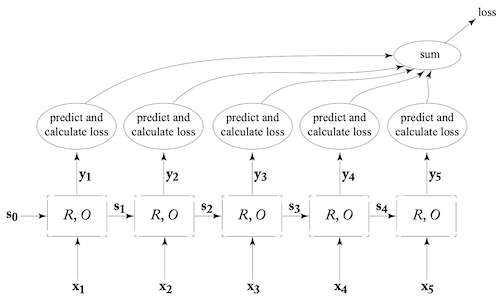

* BiDirectional RNN (BIRNN)
    * relaxes fixed window size assumption
    * can use all the words around the focus word
    * forward state $s_i^f$ based on $x_1,...,x_i$, backward state $s_i^b$ based on $x_n,...,x_i$
    * Model is concatenation of 2 RNN. One fed sequence in order, second fed sequence in reverse. for ith seq position, $BiRNN(x_{1:n},i)=[RNN^f(x_{i:i});RNN^b(x_{n:i})]$, or can use $[RNN^f(x_{i:i});RNN^b(x_{n:i})]\bm{W}$ to reduce output dimension
    * output $y_i=[y_i^f;y_i^b]$

* Multi Layer (Stacked) RNN
    * also called deepRNN
    * not clear (theoretically) why it will improve performance but it does
    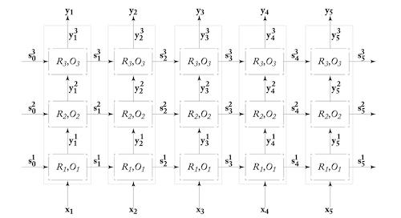

* RNN for stacks
    * sometimes we need feature extraction for stack of values/elements
    * instead of using k-top elements, use RNN over all elements
    * how to handle push? - simply update the RNN state by feeding new element
    * how to handle pop? use **persistent stack data structure**
        * stack is a head pointer in a linked list
        * see fig
        * results in a tree
        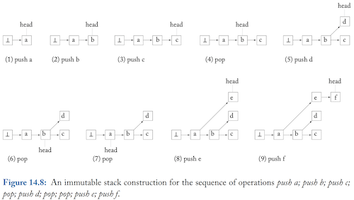
    * same process on RNN's computation graph, results in a tree
    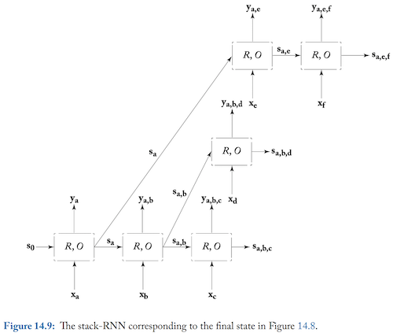
* <b id="note1">Important Note for Literature</b>
    * papers often don't give explicit implementation details
    * can miss out on loss function, padding, concatenating layer output or not, etc. 
    * lots and lots of small details

## Concrete RNN Architecture
(Skipped a lot here because already covered in DL Specialization notes. Feel free to contribute here.)
* CBOW: $s_i=R(x_{1:i},s_{i-1})=\bm{s_{i-1}+x_i}$
* Elman Network or Simple RNN
    * $s_i=R(x_{1:i},s_{i-1})=g(\bm{s_{i-1}{W^s}+x_i{W^x} + b})=g(\bm{[s_{i-1};x_i]W+b})$
* Why vanishing Gradient? RNN is a deep NN. After repeadtedly multiplying the same matrix W for gradient, the effect of gradient in later stages is greatly reduced (vanish) or explodes in early time steps.
* <b id="hadamard">Hadamard product</b>= element wise product = $x\odot b$
* LSTM
    * c - memory, h - hidden state
    * i(input), f(forget), o(output)
    * **Note** Recommended the bias term of forget gate with 1 

$$\bm{s_i}=LSTM(\bm{x_{1:i},s_{i-1})}=[\bm{c_i;h_i}]\\
\bm{c_i}=\bm{i\odot x_i+f\odot z}\\
h_i=o\tanh(c_i)\\
\bm i = g(\bm{[x_i;h_{i-1}]W_i + b_i})\\
\bm f = g(\bm{[x_i;h_{i-1}]W_f + b_f})\\
\bm o = g(\bm{[x_i;h_{i-1}]W_o + b_o})\\
\bm z = \bm{o} \tanh(\bm{[x_i;h_{i-1}]W_z + b_z})\\
y_i=h_i$$

* GRU
    * fewer gates
    * has an additional relevance gate to control the impact of previous state on new cadidate state

$$\bm{s_i}=GRU(\bm{x_{1:i},s_{i-1})}\\
\bm{s_i}=\bm{(1-f)\odot x_i+f\odot \hat{s_i}}\\
\bm r = g(\bm{[x_i;s_{i-1}]W_r + b_r})\\
\bm f = g(\bm{[x_i;s_{i-1}]W_f + b_f})\\
\bm{ \hat{s_i} }= \tanh(\bm{[x_iW^{xs} + (r\odot s_{i-1})W^{ss} + b_z})\\
y_i=s_i$$

* Variation of Simply RNN

$$y_i=[c_i;h_i]\\
c_i=(1-\alpha)x_iW^{x1}+\alpha c_{i-1}\\
h_i=g(x_iW^{x2}+ c_{i}W^c + h_{i-1}W^h)$$

* **Note** Beyond Gates: Keep an eye out for Neural Turing Machine and differentiable Stack
* Droupout
    * apply between layers of RNN (non recurrent part)
    * tough to apply on recurerent part - information might get lost across time steps
    * Apply same mask for all time steps in dropout

## Modeling with RNN
* sentence level sentiment classification
    * ex. movie reviews into +ve and -ve
    * method1: tokenize the sentence, feed into RNN, use output in MLP with 2 outputs, softmax and the cross entropy loss
    * method2: use biRNN
    * method3 (hierarchial): divide the sentences into multiple spans (ex. based on punctuation), pass each span through a BiRNN, their outputs are now a sequence, feed this sequence to RNN then MLP and softmax with cross entropy loss
* document level sentiment classification
    * similar to method 3 above, but instead use the sentences as spans
    * variation: after getting output from level2 RNN in above, take the average of the output vector in all timesteps of level2 RNN and then feed it to MLP
* Subject-Verb Agreement Grammaticality detection
    * ex. "keys are on the table", "keys is on the table", "keys for the black cupboard are on the table"
    * becomes easy if we have parse tree
    * feed it all to RNN with cross entropy - Works very well
* POS tagging
    * encode words$x_i=\phi(w_{1:n},i)$, use BiRNN on $x_{1:i}$ to get $y_i$ for all i. These go to MLP for giving the tag.
    * how to encode?
        * embedding vectors (problem with unseen words)
        * convert each character to a vector and use character level BiRNN (forward focuses of suffixes and backward focuses on prefixes)
        * can concat the above two as well
        * character level CNN
    * structured model: can also use previous tags
        * k-window of tags : feed previous k tag vectors along with $y_i$ to MLP
        * use RNN: feed all tag vectors so far to RNN, concat that to $y_i$ and use in MLP
* Document Classification
    * use character level RNN/CNN to get word vectors
    * Use character level heirarchial CNN to get a small vector from one (or more) words for each word
* ARC-Factored dependency parsing
    * we have to create the dependency tree
    * a function for each word pair ($w_i,w_j$), given the strength associated with $w_i$ being the head of $w_j$
    * replace this function with MLP on concatenation of 2 BiRNN vectors (for head and modifier words)
    * concat word vector and POS tag vector, feed it to BiRNN
* **Note**: thus when we need word features sensitive to their position and sentence structure, use BiLSTM vectors 

## Conditioned Generation
* RNN generator
    * start with a start symbol, get conditioned distribution, pick best/random/beam search, and feed it as input to generate the next symbol and so on until end of sentence. 
    * new word is picked from the distribution generated by RNN - $p(t_j=k|t_{1:j-1})$
    * Character level RNN have show incredible sensitivity to previous words (and longer history) to make meaningful patterns.
* Training RNN generator
    * train it as a transducer
    * if sentence is $w_1,w_2,w_3,..,w_n$ and $n+1$ is eos, then these $n+1$ are the inputs and expected outputs.
    * Since we are feeding $w_i$ even when $w_{i-1}$ is not the max probabilty, this method is called <b id="teacher-forcing">teacher forcing</b>. BUT it has problem handing deviations from gold sequence
* Conditioned Generator (Encoder-Decoder)
    * simple RNN generator is 
    * $\bm{\hat{t}_{j+1}}\sim p(\bm{t_{j+1}=k|\hat{t}_{1:j}})$ where $p(\bm{t_{j+1}=k|\hat{t}_{1:j}}) = f(RNN(\bm{\hat{t}_{1:j}}))$ where f can be softmax or MLP over RNN output
    * Conditioned generation - at each stage of generation, concat a conditioning context vector $c$ to the previously generated token. So,
    * $\bm{\hat{t}_{j+1}}\sim p(\bm{t_{j+1}=k|\hat{t}_{1:j},c})$ where $p(\bm{t_{j+1}=k|\hat{t}_{1:j},c}) = f(RNN(\bm{v_{1:j}}))$ where $v_i=[\bm{\hat{t}_i;c}]$
    * 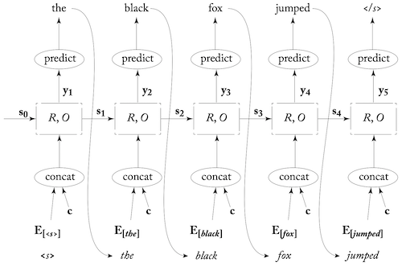
    * choices for $c$
        * news topic for news generation/summarization
        * movie genre for reviews
        * text tense etc for text analysis
* **Sequence To Sequence** (Encoder Decoder)
    * $c$ is a sequence
    * input $\bm{x_{1:n}}$ (eg. French sentence) and output is $\bm{x_{1:m}}$ (eg. English sentence)
    * encode $\bm{x_{1:n}}$ using an encoder (usually RNN) $\bm{c}=RNN^{enc}(\bm{x_{1:n}})$ and then use this in a conditioned generator (RNN decoder) to get $\bm{x_{1:m}}$
    * train both encoder decoder together, supervision on decoder with <i id=doubt2>"langauge model objective"</i>
    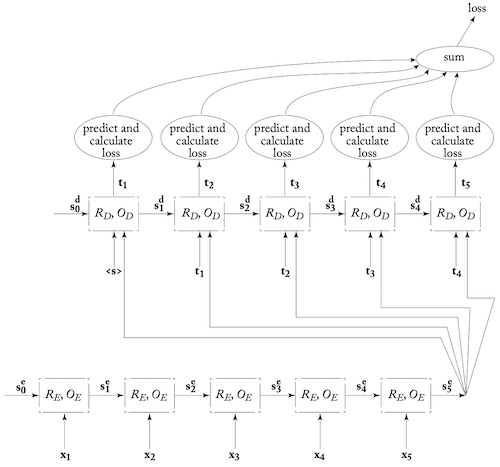
    * Applications:
        * machine translation : Tip - input sequence fed in reverse so that first word can have more impact on first word in translation
        * Email auto response :eg. google inbox. Refer to the [paper](https://www.kdd.org/kdd2016/papers/files/Paper_1069.pdf)
        * morphological inflection : char level seq2seq model, given root and the expected inflection (eg. gender, tense etc) produce the expected morphological inflection
    * seq2seq can't be used everywhere. Some other architectures give better results, but seq2seq is hard to apply but still gives good results
        * sentence compression by deletion: eg. He, the author of 4 books, will get paid -> He will get paid. seq2seq output is a seq of Keep, Delete and Stop operations. -> basically a seq tagging task, BiRNN can do better
        * POS tagging, NER - again seq tagging task
        * syntactic parsing
* Other conditioning contexts
    * CNN output, or some other model 
    * in Dialog, use an trainable embedding vector of user responses to condition on user syle (age, gender etc) and capture that in created response
    * Image as condition for *image captioning*
    * *visual storytelling* - series of images as input and story is an output
* **Unsupervised sentence similarity**
    * find a method to compare similar sentences. How? - convert to vectors. How? 
        * use seq2seq and train for some task
        * throw away the decoder
        * the encoder output $c$ is supposed to be a good representation of the sentence
        * comparison method depends on the task used 
    * Auto Encoding
        * encode sentence and reproduce it
        * should encode the necessary info
        * might have large dist when similar meaning but different words
    * Machine Translation
        * English to some other language
        * vector must capture the essence of the sentece
    * **skip thoughts**
        * hypothesis: similar sentences appear in similar contexts, where context are the surrounding sentences
        * encode sentence to vectors
        * use one decoder to produce previous sentence
        * use another decoder to produce following sentence
        * [paper](https://papers.nips.cc/paper/5950-skip-thought-vectors.pdf)
    * syntactic similarity: use seq2seq to produce a sream of bracketing decisions, captures syntactic structure
* Conditioned generation with attention
    * uses a *soft attention mechanism* to decide on which parts of sentence should be focused on
    * encoder, decoder and attention mechanism are all trained together
    * get seq of vectors from input seq $\bm{x_{1:n}}$, $\bm{c_{1:n}}=\text{biRNN}^*(\bm{x_{1:n}})$
    * for generation step $j$, attention vector is $\bm{c}^j=\text{attend}(\bm{c_{1:n}},\hat{t}_{1:j})$
    * use it to generate next word,$\hat{t}_{j+1}\sim p(t_{j+1}=k|t_{1:j},\bm{x_{1:n}})=f(RNN([\bm{t_{1:j};c^j}]))=f(O(\bm{s_{j+1}})), \bm{s_{j+1}} = R(\bm{s_j,[t_j;c^j}])$, $f$ can be softmax over MLP
    * attend function can be anything, below is one used by the original author of attention mechanism
        * $\bm{c^j=\sum_{i=1}^n\alpha_{[i]}^j \cdot c_i}$, where $\bm{\alpha^j}$ is vector of attention weights fot stage j, and $\bm{\sum_{i=1}^n\alpha_{[i]}^j}=1$, $\bm{\alpha_{[i]}^j}>=0 \text{  }\forall i$ 
        * getting weights: $\bm{\alpha_{[i]}^j=\alpha_{[1]}^j,..,\alpha_{[n]}^j}=\text{softmax}(\bm{\bar{\alpha}_{[1]}^j,..,\bar{\alpha}_{[n]}^j})=\text{softmax}(\text{MLP}^{\text{att}}([\bm{s_j},\bm{c_1}]),..,\text{MLP}^{\text{att}}([\bm{s_j},\bm{c_n}]))$, where $\bm{s_j}$ is decoder state at stage $j$
        * try writing the entire model end-to-end!
    * Why use attention on encoder output and not input directly?
        * each $\bm{c_i}$ represents each word $\bm{x_i}$ in it's *sentential context* (a window around the word)
        * can extract relevant properties of the input using trainable encoder
        * 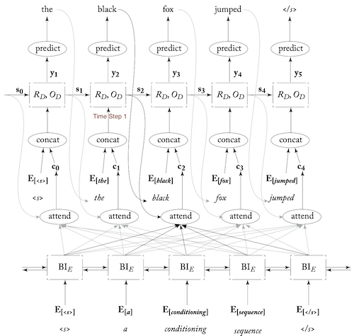
    * time complexity is $O(m\times n)$, ( excluding the scoring function, like softmax)
    * *interpretability*: non-attentive encoder-decoder don't tell much about the encoding and how decoding happens, attention weights give some insight on what is being used for decoding
* Applications of Attention - State of the Art
    * Machine Translation: Use attention. Improvements by changing input. Some improvements below:
        * sub word units: use BPE to get prominent sub words, eg. er, est, un, low, wid. Converts, *widest network* to *wid_ _est net_ _work*, feed to network, process output to combine subwords
        * incorporating monolingual data: usually MT models are trained on parallel corpora of aligned sentences in source and target language. 
             * *Translational Model* on parallel data
             * *language model* on monolingual data(much larger dataset)
             * in Seq2seq decoder is language model and encoder-decoder interaction is translational model. How to take advantage of monolingual data
                * one hacky method: source language A and target language B. first train a translation model from B to A. Convert all monilingual data of B to A. now use these (B,A) pairs as (A,B) to train your translation model
        * linguisitc annotations: supplement input with linguistic annotation. Instead of just using embedding vector of word, concat it with vector of POS tag, dependency label (parse tree), lemma and morphological features
    * morphological inflection: attentive seq2seq; input:list of info like target POS, gender, noun etc and list of input word characters; output is target word characters
    * syntactic parsing: input-seq of words, output-seq of bracketing decision. Need much more refinements in data, and output parser.

## Modeling Trees with RNN
* uses:
    * syntactic trees, discourse trees, trees representing sentiment in various parts of words
    * predict based on nodes, leaves, structure, span
* RecRNN
    * recursive RNN - for Binary Trees
    * encodes a node of the tree
    * $vec(p)=f(vec(c_1),vec(c_2))$ where $c_1$ and $c_2$ are children on $p$
    * just as in RNN $s_i$ encodes info on sequence $x_{1:i}$, RecRNN encodes everything in the subtree p.
    * Binary Tree $T$ over n-word sequence
    * unlabeled tree over seq $x_1,..,x_n$
        * can be represented as a unique set of triples $(i,k,j), \text{  }i\leq k\leq j$
        * the node spans $x_{i:j}$ and is the parent of the nodes spanning $x_{i:k}$ and $x_{k+1:j}$
        * terminal is (i,i,i) for word $x_i$
    * labeled tree over seq $x_1,..,x_n$
        * tuple $(A\rightarrow B,C,i,k,j)$, where A,B,C are the labels for $x_{i:j}$, $x_{i:k}$ and $x_{k+1:j}$ respectively
        * terminal is $(A\rightarrow A,A,i,i,i)$
        * These tuples are called **production rules**
        * production rule $(A\rightarrow B,C,i,k,j)$ can denote the respective node as $q^A_{i:j}$
        * eg- 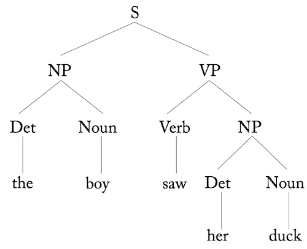, 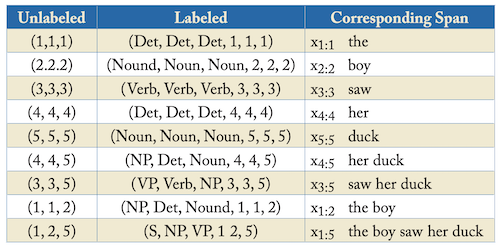
* RecRNN Definition
    * Tree $T$ over seq $x_1,..,x_n$ with production rules $(A\rightarrow B,C,i,k,j)$ and nodes denoted as $q^A_{i:j}$
    * each node has a **inside state vector** $s^A_{i:j}$ which represents the node $q^A_{i:j}$ and it's children subtrees
    * RecRNN is as below, where 
        * $v(x_i)$ is the encoding of $x_i$
        * R is a linear transformation with/without non-linear activation
        * label encoding for A is v(A)
        * $W^{BC}$ is weight for a label combination of BC (used only when number of such combinations is small)
    
$$R(x_1,..,x_n,T)=\{s^A_{i:j}\in \mathbb{R}^d|q^A_{i:j}\in T\}\\s^A_{i:i}=v(x_i)\\
s^A_{i:j}=R(\bm{A,B,C,s^A_{i:k},s^A_{k+1:j}})=g(\bm{[s^A_{i:k};s^A_{k+1:j}]W}), \bm{W} \in \mathbb{R}^{2d\times d}\\
\text{ if using label encoding,}\\
s^A_{i:j}=g(\bm{[s^A_{i:k};s^A_{k+1:j};v(B);v(C)]W}), \bm{W} \in \mathbb{R}^{2d+2d_{label}\times d}\\
\text{alternatively } s^A_{i:j}=g(\bm{[s^A_{i:k};s^A_{k+1:j}]W^{BC}})
$$
*   * <b id="outside-state">Outside State Vector</b>: encode subtrees and also represent entire structure around that node in subtree. Can be thought of as BiRNN equivalent. More info at [paper](https://www.aclweb.org/anthology/D14-1081.pdf)
* variants:
    * LSTM type RecRNN to address vanishing gradient
    * recursive vector-matrix model: represent word with vector (normal encoding) and matrix (learnable, better than adding and linear transformation)
    * recursive neural tensor network <b id="recrnn-tensor"></b>
* Training: define loss over tree/node/set of nodes using their labels and then backpropagate
* RecRNN can be used as an encoder as well
* Linearized Tree: If recursion not required and need encoding sensitive to tree structure; linearize the parse tree and feed it into RNN or BiRNN; use that as encoding; or train RNN over tree as language model and use that to evaluate it
* RecRNN for modelling langauge as tree structure not very strong. Normal RNN work just as well.

## Terms
* OOV - out of vocabulary
* POS - part of speech
* NER - named entity recognition
* [word signature](#word-signature)
* [Perplexity](#perplexity)
* [Smoothening](#smoothening-mle)
* [Jacaard](#jacaard)
* [PMI, pointwise mutual information](#pmi)
* MLP - Multi Layer Perceptron
* [word2vec](#word2vec)
* [Byte Pair Encoding](#bpe)
* [3CosAdd](#3cosadd)
* [Feature Hashing/Hash Kernel](#feature-hashing)
* [BackPropagation Through Time](#bptt)
* [Teacher Forcing](#teacher-forcing)

Important Notes
* [Literature](#note1)

## Doubts
* [transformation on embedding matrix](#doubt1)
* why vanishing gradient in rnn
* [Language modeling objective in seq2seq](#doubt2)
* [Rec Neural Tensor Network](#recrnn-tensor)

## Things To Read Up
* [Borel Measurable Functions](#borel)
* [Ranking Loss](https://gombru.github.io/2019/04/03/ranking_loss/)
* [Kernel methods and SVM](#kernel-method)
* [Traditional Language Modelling](http://www.cs.columbia.edu/~mcollins/lm-spring2013.pdf)
* adaptive learning rate algorithms, RMS Prop, Adam, AdaDelta (Deeplearning lectures)
* SGD plus momentum (Deeplearning lectures)
* [Gmail auto response paper](https://www.kdd.org/kdd2016/papers/files/Paper_1069.pdf)
* have added some notes as **note**/**tip** which I found noteworthy/useful
* [outside state vector](#outside-state)