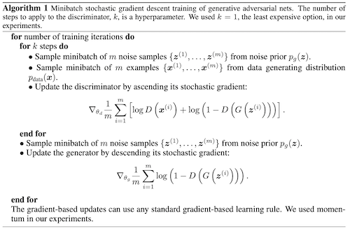

# Generative Networks
<!-- TOC -->

- [Generative Networks](#generative-networks)
    - [GAN](#gan)
    - [DCGAN](#dcgan)
    - [Other Models To Check](#other-models-to-check)
    - [Doubts](#doubts)

<!-- /TOC -->

## GAN
* **[Paper](https://arxiv.org/pdf/1406.2661.pdf)**
* **Concept** (One Line)
    * One generative model G to approximate training data distribution, one discriminative model D to identify if sample came from training data or from G. Both are pitted against each other until generative model reached a probability of 1/2 for each sample.
* **Analogy**
	* Discriminator is police and generator is a counterfeit, both trying to outsmart each other. (Catch me if You Can)
* **Model**
	* Both G and D are MLP (Multi Layer Perceptron) - Easy
    * Generator
        * We want to learn distribution of generator $p_g$ on input **x**
        * prior over input noise = $p_z(z)$
        * maping to data space = $G(\bm{z};\theta_g)$, G is MLP with parameters $\theta_g$
        * Objective : Minimize $\log(1-D(G(z)))$ or maximise $D(G(z))$ (this provides better gradients in early stages of learning)
    * Discriminator
        * MLP $D(\bm{x},\theta_d)$
        * output is scalar = probability that $\bm{x}$ belongs to the data and does not come from $p_g$
        * Objective: Assign correct label to training data and samples from G
    * Overall Objective: Min-Max game with Value function V(G,D)
        * $\min_G \max_D V(G,D)=\mathbb{E}_{x\sim p_{data}(x)}[\log D(\bm{x})]+\mathbb{E}_{z\sim p_z(z)}[\log(1-D(G(z)))]$
        * train k steps of D and then one step of G
            * D remains close to optimal solution if G changes slowly
    * Algorithm 
    * Theory
        * For the defined minmax game
            * global optmimum $p_g=p_{data}$
            * For fixed G, optimal D = $\frac{p_{data}(x)}{p_{data}(x)+p_g(x)}$
            * objective can be seen as MLE $C(x)=V(G,D)$ for estimate the conditional probability $P(Y=y|x)$ where $Y=1$ when x is from $p_{data}$ and $0$ otherwise.
            * Check paper for proofs of the above and proof of convergence of the algorithm.
    * **Problems**
        * Difficult to train: convergence to stable solution is tough, depends a lot of hyperparameters
        * lot of noise in generated images

## DCGAN
* **[paper](https://arxiv.org/pdf/1511.06434.pdf)**
* **Concept**
    * use CNN in generator and discriminator. Also gives contraints for stable networks. Also shows strength of DCGANs for representation learning.
* **Previous Work**
    * Representation Learning from Unsupervised Data
        * Autoencoders, Clustering, Hierarchial Clustering, Deep Belief Networks
    * Image generation
    * Visualising NN: Use deconvolutions and filter for maximal activations to see what is being captured by that filter. Also can use gradient descent on the input to see the ideal image that activates these filters. (<b id="check1">CheckThis</b>)
    * **Model**
        * improvements to CNN
            * Replace any pooling layers with strided convolutions (discriminator) and fractional-strided convolutions (generator). (network learns downsampling on its own)
            * Batch Normalization. Improves stability, allows deeper layers to learn
                * shouldn't apply directly to all layers. Avoided in G's output and D's input layer
            * Remove fully connected hidden layers for deeper architectures.
            * Use ReLU activation in generator for all layers except for the output, which uses Tanh.
            * Use LeakyReLU activation in the discriminator for all layers.

## Other Models To Check
	- Restricted Boltzman Machine ( also check Markov Chain Monte Carlo Methods)
	- Deep Belief Network
	- Noise-Contrastive Estimation
	- Generative Stochastic Network

## Doubts
- [visualising Using Gradient Descent](#check1)