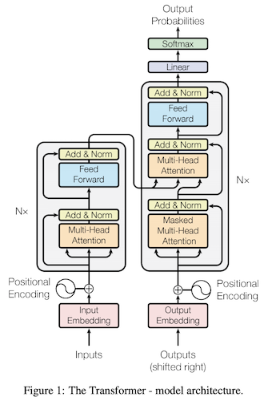
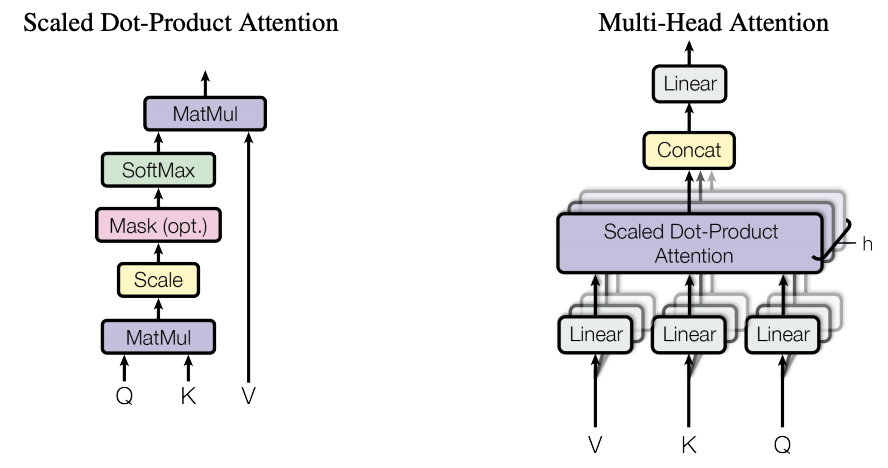
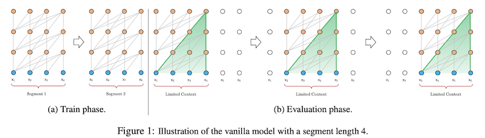
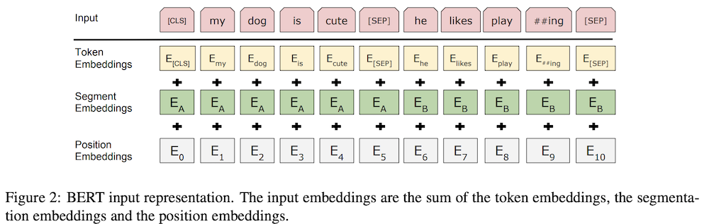
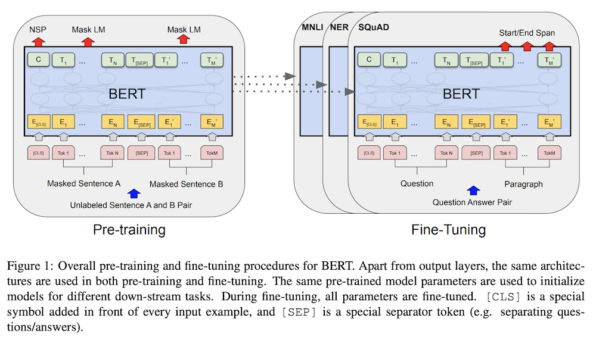

# NLP Concepts and Papers
<!-- TOC -->

- [NLP Concepts and Papers](#nlp-concepts-and-papers)
    - [Transformers](#transformers)
    - [Transformer-XL](#transformer-xl)
    - [LongFormers](#longformers)
    - [BERT](#bert)
    - [TRADE for TOD Systems](#trade-for-tod-systems)
    - [Unlikelihood Loss](#unlikelihood-loss)
    - [Truncated Log Loss](#truncated-log-loss)
    - [Other Papers](#other-papers)
    - [Template](#template)

<!-- /TOC -->
## Transformers
**Resources**: [paper](https://arxiv.org/pdf/1706.03762.pdf), [illustrated guide](http://jalammar.github.io/illustrated-transformer/), [Annotated Transformer](http://nlp.seas.harvard.edu/2018/04/03/attention.html)

**Top Advantages**
* removes the recurrence
* easier to parallelise
* better long term dependencies
* resolves vanishing gradient problem with RNNs

**New things**
* Scaled-Dot Product Attention
    * We have Query, Key and Values. Get a weighted sum of values depending on the relevance of keys with the query
* Multi-Head Attention
    * do scaled dot product but for multiple projections of Q,K and V in parallel and concat them
    * allows calculations over different representation spaces
* position encoding method

**Model Summary**
* Uses a new position encoding technique to preserve order - uses absolute positions
* Use a few layers of multi-head attention on input over input (self-attention with ) in encoder. 
* Use this in each 'cell' of decoder.
* each cell of decoder has Self-attention in output (masked to avoid taking information from words ahead in the sentence), then attention over encoding with self-attention output.

**Notable Insights**
* self-attention
    * computationally cheaper than RNN - optimized Matrix Multiplication
    * easier to propagate from output to input (Maximum path length is O(1))
    * Self-attention allows the model to look at the other words in the input sequence to get a better understanding of a certain word in the sequence. Eg. 'Dog bit it's tail'. 'It' is related to 'Dog'. More [here](https://www.analyticsvidhya.com/blog/2019/06/understanding-transformers-nlp-state-of-the-art-models/)
    
**Limitations**
* Can handle only fixed length inputs. So need to split input into chunks
* chunked data -> limited range of dependencies
* if you chunk sentences to feed into transformers, then you have the problem of **context fragmentation** because a split sentence looses context present in other chunks
* computation cost scales quadratically with sequence length

**Questions**
* what's the logic behind self-attention, how exactly is it helping? The logic presented only explains the benefit of the attention mechanism which holds true for using the multi-head attention without self attention. What exactly is the intuition here?
* why is masking necessary in transformers? - To make sure output at i depends only on outputs before position i. But WHY is this important? Why not just mask itself?
* Can someone explain their position encoding scheme to me?
* (Solved) How exactly does it avoid recurrence? Because decoder states depend on the encoder finishing it's job -> That's only Layering. If one layer, then it's just two steps of sequential attentions.

## Transformer-XL
**Resources**: [paper]()

**Top Advantanges**
* Captures longer-term dependencies
* resolves context fragmentation to some extent
* "Transformer-XL learns dependency that is 80% longer than RNNs and 450% longer than vanilla Transformers, achieves better performance on both short and long sequences, and is up to 1,800+ times faster than vanilla Transformers during evaluation."

**New things**
* Recurrence mechanism to transformers
    * Instead of computing the hidden states from scratch for each new segment, concat/reuse the hidden states obtained in previous segments.
    * The reused hidden states serve as memory for the current segment, which builds up a recurrent connection between the segments. 
    * Thus, information can be propogated -> modeling very long-term dependency becomes possible and solves context fragmentation (3.2 in paper for formal definition)
    * Note: Gradient remains within one segment. Only the segment encoding goes to next segment to provide context
    * can concat multiple previous segments to increase range of the model (depends on available memory)
* New Relative position encoding
    * "avoids temporal confusion", "generalizes to attention lengths longer than the one observed during training"
    * instead of using an absolute position encoding, use the relative distance between the positions. Ex. when calculating attention score between $x_i$ and $x_j$, use $R_{i-j}$ (sinusoid encoding matrix) for position instead of the absolute one in original transformers
    
**Model Summary**
* In any layer of the encoder, concat the prev-layer output for previous segment to the key and value, then use the layer.
* This combined with relative position encoding enables model to understand the position of the context words relative to current words -> longer dependency

**Notable Insights**

**Misc things**
: It is for the LM task.

**limitations**
* Not pretrained
* computation cost still scales quadratically with sequence length

**Questions**
* What is sinusoid encoding matrix
* Understand the position encoding used

## LongFormers

**Resources:**
[Paper](https://arxiv.org/pdf/2004.05150.pdf)

**Top Advantages**
* Pretrained on multiple tasks
* computation scales linearly with input seq length as compared to quadratic in transformer
* This attention pattern can be plugged into any pretrained transformer model without the need to change the model architecture: (Eg. they used RoBERTa checkpoint for their model. section 5)
* Was able to run on sequence lengths of 32,256 compared to 512 in BERT

**New Things**

New Attention mechanism. Combo of two
* Local-context self attention: learn context representations
* global attention: "end task motivated", builds full sentence representations for task
* New custom CUDA kernel TVM for performing the banded matrix multiplications which are not currently supported by DL libraries

Attention Patterns
* Sliding Window
    * Attend over a window w around the token
    * $O(n\times w)$
    * as you stack $l$ layers, the "receptive field" increases (like in CNN) to $l\times w$
    * $w$ becomes hyperparameter
* Dilated Window
    * use dilated window like in CNN kernels
    * increases receptive field without increasing computation
    * receptive field becomes $l\times d\times w$, scales to thousands of tokens
    * Use different values of $d$ for different heads in Multi-Head Attention: small value for local context and large value for longer context
* Global Attention
    * For some selected input locations, attend to all locations and all locations attend to that token (symmetric)
    * Task specific. Ex, for QA, global for question tokens
    * only for a select tokens $k<<n$, so complexity still remains $O(n)$

**Model Summary**
* uses two sets of projects of Q,K,V. One for sliding window and other for global attention - flexible use depending on task
* use different dilations in different projections for sliding window

* LM task: increase window size for upper layers. Dilation only in a small number of heads in upper layers

**Notable Insights**
* Attention matrix in transformers
    * Left-to-right: process chunks from ltr. Good for autoregressive modelling tasks like LM. Looses out when model can benefit from bidirectional context
    * Sparse: Don't compute the full $n^2$ attention matrix. ex. Dilated sliding window by [BlockSparse](https://openai.com/blog/block-sparse-gpu-kernels/) in [sparse transformer](https://arxiv.org/pdf/1904.10509) 
    * can plug in the long version into other transformer models. [Script](https://github.com/allenai/longformer/blob/master/scripts/convert_model_to_long.ipynb)

**Misc things**
: For LM and long document modelling, paper used character level model.

**limitations**

**Questions**
* What is [BlockSparse](https://openai.com/blog/block-sparse-gpu-kernels/) and [sparse transformer](https://arxiv.org/pdf/1904.10509)
* Training strategy of this model for LM (section 4.2)
* TODO:Read up how it is pretrained for different tasks

## BERT

**Resources**
: [Paper](https://arxiv.org/pdf/1810.04805.pdf), [Pretrained Model](https://stats.stackexchange.com/questions/193082/what-is-pre-training-a-neural-network), [blog](https://towardsdatascience.com/bert-explained-state-of-the-art-language-model-for-nlp-f8b21a9b6270)

**Top Advantages**
* Strong Pretrained model (for both fine-tuning and feature based approach)
* Bidirectional
* single pre-trained model is SOTA for a lot of tasks, beating tasks specific architectures - Unified architecture
* can have bidirectional cross attention between two sentences

**New Things**
* Deep bidirectional transformers: shows bidirectional pre-training gives better language representation
* MLM - Masked LM
    * randomly mask some of the input tokens. Now try to predict these correct vocab id of these tokens using the surrounding context in pretraining
    * mask 15% tokens and use softmax only on them. 80% of these are replaced with MASK token, 10% with random token, 10% with original token
    * refer to the [blog](https://towardsdatascience.com/bert-explained-state-of-the-art-language-model-for-nlp-f8b21a9b6270) - AppendixA for details

**Model Summary**
* pretrain on unlabeled data, fine-tune on labeled data for downstream tasks
* Input (see fig2): 
    * seq of tokens - can be a single sentence, or a sentence pair (<Q,A>)
    * begins with [CLS] token
    * sparate sentences with [SEP] token and add a sentence embedding indicating Sentence A or Sentence B to each token. Sentence embeddings are similar in concept to token embeddings with a vocabulary of 2.
    * Add positional embedding like in transformer 
 
* Training: Train using 2 tasks.
    * MLM
        * to get word representations
        * softmax over masked words to calc loss
    * NSP
        * use representation corresponding to [CLS] token
        * use classificiation layer to predict if next sentence or not

**Notable Insights**

2 way of applying pre-training
* feature based: used the pretrained representation as additional feature in the new architecture
* Fine-tuning: add some minimal task specific params and use the pre-trained params. Train on the new task and update ALL params.

MLM:
* Models before BERT are restricted because they try to solve the unidirectional task of language modelling.
*  new prediction goal for LM training. Allows to use bidirectional models
* without this, a bidirectional model will be able to indirectly see the word it is trying to predict

**Misc things**
* Output corresponding to token [CLS] to be used for classification tasks (eg. sentiment analysis), token representations to be used for token level tasks (eg. NER)
* Gives great performance when used as features directly - saves a lot of compute during finetuning
* hypothesizes that when the model is fine-tuned directly on the downstream tasks and uses only a very small number of randomly initialized additional parameters, the task specific models can benefit from the larger, more expressive pre-trained representations even when
downstream task data is very small.

**limitations**
* unput token limit of 512
* converges slowly because loss is calculated only on the masked tokens

**Questions**
* Don't understand the problem it is solving
* How can it be used for LM?
* Masking - why is it done like it is done
* is the word-to-token embedding fine tuned/pre-trained/transferrable as well or not?
* TODO:Read up how it is fine tuned

## TRADE for TOD Systems

**Resources**
[Paper](https://arxiv.org/pdf/1905.08743.pdf)

**Top Advantages**
* generates dialogue states from utterances using a copy mechanism, facilitating knowledge transfer
when predicting (domain, slot, value) triplets
not encountered during training
* overcomes the problem of exhaustively listing all possible values of all slots (as required by previous models) - generates slot value directly instead of a probability of each value
* over comes lack of knowledge sharing between domains by sharing parameters for all domains. (eg. area slot can be shared between restaurant domain and hotel domain)
* zero shot learning with few examples for new domians withour forgetting old domains

**New Things**
* parameter sharing between domains
* directly generating slot value
* Utterance encoder
    * dialog history utterances to sequence of fixed-length vectors (n utts to n vector representations)
* context enhanced Slot gate:determine if any (domain,slot) value is mentioned. Outputs none, don't care and ptr
* state generator

**Model Summary**
* Utterance encoder to convert utterances to seq of fixed-length vectors $H_t$
* state generator decodes multiple output tokens for all (domain,slot) pairs independently
* state generator GRU 
    * first input is (domain,slot) encoding for each (domain,slot) pair
    * at step k, takes in a word embedding to produce a hidden state
    * hidden state is mapped to 2 distribution
        * over voabulary - hidd * E
        * over history - hidd * $H_t$
    * final prob is a weighted sum of these two (combines the two dist) - distribution over vocab
    * weight is obtained using a MLP on hidden state, context and word embedding
    * context vector is attened over $H_t$ using the distribution over history
* use Slot gate on context to figure out if the value is needed for this (domain, slot) pair
* optimization: cross entropy loss for slot gate and state generator

**Notable Insights**

**Misc things**
* achieves state-of-the-art joint goal accuracy of 48.62% for the five domains of MultiWOZ
* achieves 60.58% joint goal accuracy in one of
the zero-shot domains
* three types of copy mechanisms - index based, hard-gated, soft-gated

**limitations**

**Questions**
* read up on copy mechanisms!
* What is the word embedding at k step of state generator?
* read up on continual learning techniques - elastic weight consolidation (EWC) and gradient episodic memory (GEM)

## Unlikelihood Loss

**Resources**
[paper](https://www.aclweb.org/anthology/2020.acl-main.428.pdf)

**Top Advantages**
* significant reduction in repitition of ngrams from context (copied from context) and within generated utterance

**New Things**
* add new term to loss function, which tells the model to
    * reduce repitions - penalise is generated token is 
        * already in utterance 
        * already in context
        * mix of both
    * pulls the model distribution of tokens closer to actual human distribution

**tags**
loss,objective,unlikelihood

## Truncated Log Loss

**Resources**
[paper](https://www.aclweb.org/anthology/2020.acl-main.66.pdf)

**Top Advantages**

**New Things**
* loss calculations
* rejection sampling

**Model Summary**
* hot start the model normally on log loss for some batches
* maintain an online estimate of quantile over batches
* remove examples with loss above the quantile

**Notable Insights**
* Log loss is very sensitive to outliers (check fig1 in paper)
* thus it picks up noise and other irrelevant abberations in data
* Better to optimize for **Distinguisability**
    * indistinguishable generated text is better quality
    * problem: challenging to do so

**Misc things**

**limitations**

**Questions**
* Understand rejection sampling

**tags**
loss, objective, truncated, sensitivity

## Other Papers
* [TOD Survey(2020)](https://arxiv.org/pdf/2003.07490.pdf): Survey of Task Oriented Dialog Systems. Nicely summarises the problem and demarcates the latest models by the problems they solve.
* [Mem2Seq](https://www.aclweb.org/anthology/P18-1136.pdf): SOTA model for TOD using KB and history. DID NOT UNDERSTAND the implementation at all.

## Template

**Resources**

**Top Advantages**

**New Things**

**Model Summary**

**Notable Insights**

**Misc things**

**limitations**

**Questions**

**tags**
