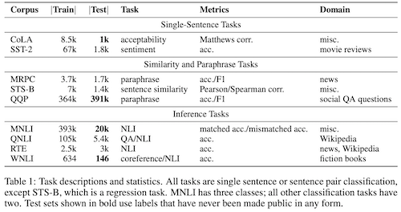

# Supporting Concepts

## What it Contains?
Concepts of probability, ML, etc frequently used in ML

## Probability
* **Prior Distribution** : (Also see Bayes Theorem) Prior is the assumed distribution of a variable without any known data. 
    * Eg. We can assume a distribution (prior) for the winner of an election (can use any parameters like temperature, day, year, turnout etc) and then when we get some information about elections (eg. voter turnout), we use this information with our model to get the distribution (posterior) of the winner given the turnout.
* **Bayes Theorem**
* Conditional Probability
* E,F two mutually exclusive events in a sample space, experiment is repeated until E or F occures. P(E happens before F) = $\frac{P(E)}{P(E)+P(F)}$
* **Posterior Distribution**
* **Parzen Window**: For estimating the probability distribution from a sample. More details [here](http://www.personal.reading.ac.uk/~sis01xh/teaching/CY2D2/Pattern2.pdf)

## Datasets
* **[SQuAD 2.0](https://rajpurkar.github.io/SQuAD-explorer/)**: Stanford Question Answering Dataset (SQuAD) is a reading comprehension dataset, consisting of questions posed by crowdworkers on a set of Wikipedia articles, where the answer to every question is a segment of text, or span, from the corresponding reading passage, or the question might be unanswerable
* **[SWAG](https://arxiv.org/abs/1808.05326)**: Given a partial description like "she opened the hood of the car," humans can reason about the situation and anticipate what might come next ("then, she examined the engine"). This is a *grounded commonsense inference* task. Given a prompt and multiple options, selext the correct inference from those options.

* **[GLUE](https://openreview.net/pdf?id=rJ4km2R5t7)** : Set of multiple tasks for benchmarking and evaluating langauge models. Also has diagnositic tools for LMs.
    * 

## Benchmarks

## Metrics
* Perplexity
* BLEU
* L1 score